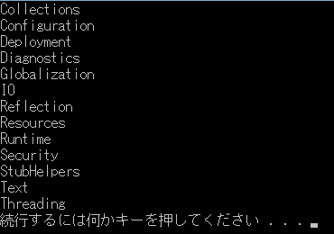
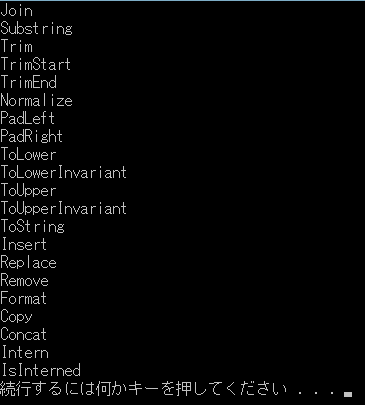

# 入門：Semantic Analysis

原文：[Getting Started - Semantic Analysis (CSharp).pdf](http://www.codeplex.com/Download?ProjectName=roslyn&DownloadId=822179)

2014年3月

## 必須項目

* [入門：Syntax Analysis](01.syntax_analysis_cs.md)
* Visual Studio 2013
* "Roslyn" End User Preview
* "Roslyn" SDK プロジェクトテンプレート

## 前書き

現在、Visual Basic や C# コンパイラはブラックボックス、つまり
テキストを入力するとバイト列が出力されるものであり、
コンパイルパイプラインの中間フェーズも全く不透明なものです。
**.NET Compiler Platform** (通称"Roslyn") を使用すると、
コンパイラがコードを理解するために秘密裏に蓄積および補完していた情報とともに、
コンパイラの使用するデータ構造やアルゴリズムと同じものを独自のツールで利用したり、
開発者が使用したりすることができるようになります。

このウォークスルーでは **シンボル** および **バインディングAPI** について説明します。

## コンパイル要素とシンボルを理解する

**シンタックスAPI** を使用することにより、プログラムの構造を確認することができます。
しかし多くの場合は、プログラムのセマンティクスあるいは意味という、
より豊富な情報が必要になるでしょう。
また、VBやC#のちょっとしたコードやスニペットの場合、
それぞれを文法的に分析することは可能であっても、
それら単体で「この変数の型は何か？」といった問い合わせをしてもあまり意味がありません。
型の名前の意味は参照するアセンブリやインポートしている名前空間、
別のコードファイル次第で異なります。
これが `Compilation` クラスの導入された由来です。

`Compilation` (コンパイル要素)はコンパイラの観点から見て
1つのプロジェクトを表すもので、
アセンブリ参照やコンパイラオプション、コンパイル対象の
一連のソースファイルといった、Visual BasicまたはC#のプログラムを
コンパイルするために必要なものすべてを表します。
このコンテキストがあることで初めて、コードの意味を決定することができます。
`Compilation` を使用すると `Symbol` つまり型や名前空間、メンバー、名前付きの引数、
あるいは別の式を参照する変数といった各エンティティを表すものを検索出来ます。
名前と `Symbol` を含む式とを関連づける操作は `バインディング(Binding)` と呼ばれます。

`SyntaxTree` と同じく `Compilation` は抽象クラスで、
言語固有の派生クラスがあります。
`Compilation` のインスタンスを作成する場合には `CSharpCompilation`
(あるいは `VisualBasicCompilation` ) クラスのファクトリメソッドを使用します。

### 例：コンパイル要素を作成する

この例では作成した `Compilation` にアセンブリ参照およびソースファイルを
追加する方法について説明します。
シンタックスツリーの場合と同じく、シンボルAPIとバインディングAPI内の
項目はいずれも不変です。

1. C# Roslyn Console Applicationプロジェクトを新規作成します。
  1. Visual Studio上で[ファイル]-[新規作成]-[プロジェクト]を選択して
     [新しいプロジェクト]ダイアログを表示します。
  2. [Visual C#]-[Roslyn] 以下から [Console Application] を選択します。
  3. プロジェクト名を "**SemanticsCS**" に設定してOKをクリックします。
2. **Program.cs** の内容を以下のように書き換えます：

   ```csharp
   using System;
   using System.Collections.Generic;
   using System.Linq;
   using System.Text;
   using Microsoft.CodeAnalysis;
   using Microsoft.CodeAnalysis.CSharp;
   using Microsoft.CodeAnalysis.CSharp.Symbols;
   using Microsoft.CodeAnalysis.CSharp.Syntax;
   using Microsoft.CodeAnalysis.Text;
   
   namespace SemanticsCS
   {
       class Program
       {
           static void Main(string[] args)
           {
               SyntaxTree tree = CSharpSyntaxTree.ParseText(
   @"using System;
   using System.Collections.Generic;
   using System.Text;
   
   namespace HelloWorld
   {
       class Program
       {
           static void Main(string[] args)
           {
               Console.WriteLine(""Hello, World!"");
           }
       }
   }");
   
               var root = (CompilationUnitSyntax)tree.GetRoot();
           }
       }
   }
   ```

3. 次に `Main` メソッドの末尾に以下のコードを追記して
   `CSharpCompilation` オブジェクトを生成します：

    ```csharp
            var compilation = CSharpCompilation.Create("HelloWorld")
                                               .AddReferences(
                                                    new MetadataFileReference(
                                                        typeof(object).Assembly.Location))
                                               .AddSyntaxTrees(tree);
    ```

4. カーソルを `Main` メソッドの **閉じ括弧** がある行に移動させて
   ブレークポイントを設定します。
  * Visual Studio上で[デバッグ]-[ブレークポイントの設定/解除]を選択します。
5. プログラムを実行します。
  * Visual Studio上で[デバッグ]-[デバッグの開始]を選択します。
6. デバッグ実行中に `root` 変数の上にマウスを移動させてデータヒントを展開させて
   変数の内容を確認します。

## セマンティックモデル

`Compilation` が生成出来たので、次はこの `Compilation` を含んだ
任意の `SyntaxTree` に対して `SemanticModel` を問い合わせることが出来ます。
`SemanticModel` を使用すると、「この位置のスコープにはどんな名前がありますか？」
だとか、「このメソッドからはどんなメンバーにアクセス出来ますか？」だとか、
「このテキストブロックではどんな変数が使用されていますか？」だとか、
「この名前/式は何を参照していますか？」というような問い合わせをすることができます。

### 例：名前のバインディング

この例ではHelloWorldの`SyntaxTree` に対応する `SemanticModel` オブジェクトの
取得方法について説明します。
このモデルを取得すると、最初の `using` ディレクティブにある名前が
`System` 名前空間の `Symbol` にバインドされていることが確認できます。

1. Mainメソッドの末尾に以下のコードを追記します。
   このコードではHelloWorldの `SyntaxTree` から `SemanticModel` を取得して、
   それを新しい変数に格納しています：

   ```csharp
            var model = compilation.GetSemanticModel(tree);
   ```

2. このステートメントが次に実行されるように設定して、
   ステートメントを実行してください。
  * この行で右クリックして[次のステートメントの設定]を選択します。
  * Visual Studioのメニューから[デバッグ]-[ステップ オーバー]を選択して
    このステートメントを実行し、新しい変数を初期化させます。
  * 上記の操作は以下の手順において新しい変数を追加し、その値をデバッガで
    確認する際には繰り返し行うことになることに注意してください。

3. 次に以下のコードを追記して、`SemanticModel.GetSymbolInfo` メソッドを使用して
   `using System;` ディレクティブの `Name` をバインドします：

   ```csharp
            var nameInfo = model.GetSymbolInfo(root.Usings[0].Name);
   ```

4. このステートメントを実行した後、 `nameInfo` 変数上にマウスを移動させて、
   データヒントを展開することで戻り値の `SymbolInfo` オブジェクトを調査します。
  * `Symbol` プロパティを確認してください。
    このプロパティはこの式が参照している `Symbol` を返します。
    参照するものが何もない式の場合(たとえば数値リテラルなど)、このプロパティは
    null を返します。
    * `Symbol.Kind` プロパティが `SymbolKind.Namespace` の値を返すことを確認します。
5. このシンボルを `NamespaceSymbol` のインスタンスになるようにキャストして
   新しい変数に格納します：

   ```csharp
            var systemSymbol = (INamespaceSymbol)nameInfo.Symbol;
   ```

6. このステートメントを実行して、デバッガのデータヒントを使用して
   `systemSymbol` 変数を確認します。
7. プログラムを停止させます。
  * Visual Studio上で[デバッグ]-[デバッグの停止]を選択します。
8. 以下のコードを追記して、 `System` 名前空間以下にある名前空間を走査し、
   それぞれの名前を `Console` に出力させます：
9. Ctrl+F5キーを押してプログラムを実行します。
   以下のような出力が得られることを確認します：

  

### 例：式のバインディング

先の例では`Symbol`を見つけるために名前をバインドする方法を説明しました。
しかしC#プログラムでは、名前ではなく別の式にバインドできるようなものもあります。
今回の例ではその他の式の型、単純な文字列リテラルに対するバインド方法を説明します。

1. 以下のコードを追記して、 `SyntaxTree` 内にある `Hello, World!` 文字列リテラルを
   見つけ出し、変数に格納します(今回の場合は `LiteralExpressoinSyntax` になります)：

   ```csharp
            var helloWorldString = root.DescendantNodes()
                                       .OfType<LiteralExpressionSyntax>()
                                       .First();
   ```

2. プログラムのデバッグを開始します。
3. 以下のコードを追記して、この式に対する `TypeInfo` を取得します：

   ```csharp
            var literalInfo = model.GetTypeInfo(helloWorldString);
   ```

4. このステートメントを実行して、 `literalInfo` を調査します。
  * `Type` プロパティがnullでないこと、および文字列リテラルがコンパイル時の型
    `System.String` になることから `System.String` の `INamedTypeSymbol`
    を返すことを確認します。
5. プログラムを停止させます。
6. 以下のコードを追記して、文字列を返す `System.String` クラスのpublicメソッドを
   走査して、それぞれの名前を `Console` に出力します：

   ```csharp
            var stringTypeSymbol = (INamedTypeSymbol)literalInfo.Type;

            Console.Clear();
            foreach (var name in (from method in stringTypeSymbol.GetMembers()
                                                                .OfType<IMethodSymbol>()
                                  where method.ReturnType.Equals(stringTypeSymbol) &&
                                        method.DeclaredAccessibility == Accessibility.Public
                                  select method.Name).Distinct())
            {
                Console.WriteLine(name);
            }
   ```

7. Ctrl+F5 を押してデバッグ無しでプログラムを実行します。
   以下のように出力されることが確認できます：

  

8. 最終的に `Program.cs` は以下のようになります：

   ```csharp
   using System;
   using System.Collections.Generic;
   using System.Linq;
   using System.Text;
   using Microsoft.CodeAnalysis;
   using Microsoft.CodeAnalysis.CSharp;
   using Microsoft.CodeAnalysis.CSharp.Symbols;
   using Microsoft.CodeAnalysis.CSharp.Syntax;
   using Microsoft.CodeAnalysis.Text;
   
   namespace SemanticsCS
   {
       class Program
       {
           static void Main(string[] args)
           {
               SyntaxTree tree = CSharpSyntaxTree.ParseText(
   @"using System;
   using System.Collections.Generic;
   using System.Text;
   
   namespace HelloWorld
   {
       class Program
       {
           static void Main(string[] args)
           {
               Console.WriteLine(""Hello, World!"");
           }
       }
   }");
   
               var root = (CompilationUnitSyntax)tree.GetRoot();
   
               var compilation = CSharpCompilation.Create("HelloWorld")
                                                  .AddReferences(
                                                       new MetadataFileReference(
                                                           typeof(object).Assembly.Location))
                                                  .AddSyntaxTrees(tree);
   
               var model = compilation.GetSemanticModel(tree);
   
               var nameInfo = model.GetSymbolInfo(root.Usings[0].Name);
   
               var systemSymbol = (INamespaceSymbol)nameInfo.Symbol;
   
               foreach (var ns in systemSymbol.GetNamespaceMembers())
               {
                   Console.WriteLine(ns.Name);
               }
   
               var helloWorldString = root.DescendantNodes()
                                          .OfType<LiteralExpressionSyntax>()
                                          .First();
   
               var literalInfo = model.GetTypeInfo(helloWorldString);
   
               var stringTypeSymbol = (INamedTypeSymbol)literalInfo.Type;
   
               Console.Clear();
               foreach (var name in (from method in stringTypeSymbol.GetMembers()
                                                                   .OfType<IMethodSymbol>()
                                     where method.ReturnType.Equals(stringTypeSymbol) &&
                                           method.DeclaredAccessibility == Accessibility.Public
                                     select method.Name).Distinct())
               {
                   Console.WriteLine(name);
               }
           }
       }
   }
   ```

9. おめでとうございます！
   これで **シンボル** と **バインディングAPI** を使用して、
   C#プログラム内にある名前や式の意味を分析することが出来るようになりました。
