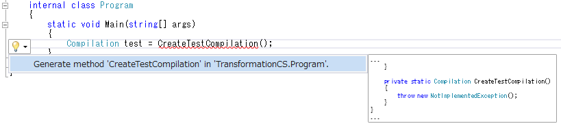

# 入門：Syntax Transformation

原文：[Getting Started: Syntax Transformation](http://www.codeplex.com/Download?ProjectName=roslyn&DownloadId=822187)

2014年3月

## 必須項目

* [入門：Syntax Analysis](01.syntax_analysis_cs.md)
* [入門：Semantic Analysis](02.semantic_analysis_cs.md)
* Visual Studio 2013
* "Roslyn" End User Preview
* "Roslyn" SDK プロジェクトテンプレート

## 前書き

このウォークスルーは **入門：Syntax Analysis** と **入門：Semantic Analysis**
で紹介した概念やテクニックを使用しています。
そのため、このウォークスルーを始める前にこれら2つのウォークスルーを
完了しておくことを強く推奨します。

このウォークスルーではシンタックスツリーの作成や変形といったテクニックを紹介します。
これらのテクニックと以前の **入門** 用ウォークスルーのテクニックを
組み合わせることにより、初めてのコマンドラインリファクタリングツールを
作成できるようになります！

## 不変性と.NET Compiler Platform

.NET Compiler Platformは不変性を基本的信条としています。
不変的データ構造は作成後には変更することが出来ないので、
あるツールが予測できないような方法で処理を行っていたとしても
別のツールには危害を加えることは無く、
複数から同時かつ安全に共有あるいは分析することができます。
ロックやその他の並列性測定などを行う必要もありません。
これはシンタックスツリーやコンパイル要素、シンボル、
セマンティックモデル、その他すべてのデータ構造に当てはまります。
変更するのでは無く、既存のものを基準として特定の項目だけが異なるような
新しいオブジェクトを作り出すことになります。
この概念をシンタックスツリーに応用することにより、
ツリー変換機能(tree transformations)が作成できます！

## ツリーの作成および「変更」

### ファクトリーメソッドを使用してノードを作成する

`SyntaxNode` を作成するには `SyntaxFactory` クラスの
ファクトリーメソッドを使用します。
ノードやトークン、トリヴィアにはそれぞれのインスタンスを作成するための
ファクトリーメソッドが用意されています。
ノードをボトムアップ形式で階層的に組み合わせることにより、
シンタックスツリーを作成することができます。

#### 例：ファクトリーメソッドを使用してノードを作成する

この例では `SyntaxFactory` クラスのメソッドを使用して、
`System.Collections.Generic` 名前空間を表す `NameSyntax` を作成します。

`NameSyntax` は C# に現れる以下の4つの型の基底クラスです：

* `IdentifierNameSyntax` は `System` や `Microsoft` というような、
  単一の識別子名を表します。
* `GenericNameSyntax` は `List<int>` のような、
  ジェネリック型あるいはジェネリックメソッドの名前を表します。
* `QualifiedNameSyntax` は`System.IO` のような、
  <左側の名前>.<右側の名前またはジェネリック名> 形式の修飾された名前を表します。
* `AliasQualifiedNameSyntax` は `LibraryV2::Foo` のような、
  アセンブリ外部エイリアスを使用した名前を表します。

これらの名前を組み合わせることにより、C# 言語中に
現れるすべての名前を表現することができます。

1. C# Roslyn Console Applicationプロジェクトを新規作成します。
  * Visual Studioで[ファイル]-[新規作成]-[プロジェクト]を選択して
     [新しいプロジェクト]ダイアログを表示します。
  * [Visual C#]-[Roslyn] 以下から [Console Application] を選択します。
  * プロジェクト名を "**ConstructionCS**" に設定してOKをクリックします。
2. 名前空間を修飾せずに `SyntaxFactory` クラスのファクトリーメソッドを
   呼び出せるようにするために、以下のコードをファイルの先頭に追加します：

   ```csharp
   using Microsoft.CodeAnalysis.CSharp.SyntaxFactory;
   ```

3. カーソルを `Main` メソッドの **閉じ括弧** がある行に移動させて、
   ブレークポイントを設定します。
   * Visual Studioで[デバッグ]-[ブレークポイントの設定/解除]を選択します。
4. プログラムを実行します。
   * Visual Studioで[デバッグ]-[デバッグ開始]を選択します。
5. まず、 `System` 名前空間の名前を表す単純な `IdentifierNameSyntax` を作成して
   変数に割り当てます。
   `QualifiedNameSyntax` を組み上げる場合にこの変数を再利用することになるため、
   変数は `NameSyntax` 型として宣言します。
   そうすることによりいずれの `SyntaxNode` にも格納できるようになります。
   型推論で定義しては**いけません**：

   ```csharp
            NameSyntax name = IdentifierName("System");
   ```

6. このステートメントが次に実行されるように設定して、
   ステートメントを実行します。
   * この行で右クリックして[次のステートメントの設定]を選択します。
   * Visual Studioのメニューから[デバッグ]-[ステップ オーバー]を選択して
     このステートメントを実行し、新しい変数を初期化させます。
   * 上記の操作は以下の手順において新しい変数を追加し、その値をデバッガで
     確認する際には繰り返し行うことになることに注意してください。
7. イミディエイトウィンドウを表示します。
   * Visual Studioで[デバッグ]-[ウィンドウ]-[イミディエイト]を選択します。
8. イミディエイトウィンドウ内で `name.ToString()` と入力後、Enterキーを押して
   式を評価します。
   その結果、文字列 `"System"` と評価されることを確認します。
9. 次にこの `name` ノードを使用して、 `name` ノードを **左側** に持ち、
   **右側** に `Collections` 名前空間の `IdentifierNameSyntax` を持つような
   `QualifiedNameSyntax` を作成します：

   ```csharp
            name = QualifiedName(name, IdentifierName("Collections"));
   ```

10. このステートメントを実行すると `name` 変数が
    新しい `QualifiedNameSyntax` になります。
11. イミディエイトウィンドウを使用して式 `name.ToString()` を評価します。
    `"System.Collections"` と評価されることを確認します。
12. このパターンを繰り返して `Generic` 名前空間に対する `QualifiedNameSyntax`
    を組み立てます：

   ```csharp
            name = QualifiedName(name, IdentifierName("Generic"));
   ```

13. このステートメントを実行して、再度イミディエイトウィンドウで
    `name.ToString()`を評価すると完全修飾名 `"System.Collections.Generic"`
    になることが確認できます。

### With*やReplaceNodeメソッドを使用してノードを変更する

シンタックスツリーは不変であるため、 **シンタックスAPI** には
既存のシンタックスツリー生成後にそれを直接変更するような機能は用意されていません。
しかし **シンタックスAPI** には既存のものに変更を加えた新しいツリーを
生成するためのメソッドが用意されています。
`SyntaxNode` から派生したそれぞれのクラスには、特定の子プロパティを
変更することができるように `With*` メソッドが定義されています。
また ｀ReplaceNode` 拡張メソッドを使用することにより、
サブツリー内にある下位ノードを置き換えることもできます。
このメソッドを使用せずにノードを更新した場合、
子が新しく追加されたということを親のノードに伝えて、
さらにその親ノードにも繰り返し手動で変更を伝えることになります。
この処理はツリーの**再スピン (re-spining)**と呼ばれます。

#### 例：With*やReplaceNodeメソッドを使用してノードを変更する

この例では `UsingDirectiveSyntax` ノードに対して `WithName`
メソッドを呼び出して、先ほど作成した名前に置き換える方法を説明します。

1. 先の例に続いて、サンプルコードファイルをパースする以下のコードを追記します：

   ```csharp
               SyntaxTree tree = CSharpSyntaxTree.ParseText(
   @"using System;
   using System.Collections;
   using System.Linq;
   using System.Text;
   
   namespace HelloWorld
   {
       class Program
       {
           static void Main(string[] args)
           {
               Console.WriteLine(""Hello, World!"");
           }
       }
   }");
   
               var root = (CompilationUnitSyntax)tree.GetRoot();
   ```
   * このコードでは `System.Collections` 名前空間が使用されていて、
     `System.Collections.Generic` 名前空間は使用されていないことを確認してください。
2. これらのステートメントを実行します。
3. `System.Collections` を先ほど作成した名前で置き換えるために、
   `UsingDirectiveSyntax.WithName` メソッドを使用して新しい `UsingDirectiveSyntax`
   を作成します。

   ```csharp
               var oldUsing = root.Usings[1];
               var newUsing = oldUsing.WithName(name);
   ```

4. イミディエイトウィンドウで `root.ToString()` を評価して、
   元のツリーにはこの新しいノードの変更が反映されていないことを確認します。
5. 以下のコードを追記して、
   `ReplaceNode` 拡張メソッドを呼び出して新しいツリーを作成し、
   既存のインポートノードを変更後の `newUsing` ノードに置き換え、
   既存の変数 `root` にこの新しいツリーを格納します：

   ```csharp
               root = root.ReplaceNode(oldUsing, newUsing);
   ```

6. このステートメントを実行します。
7. イミディエイトウィンドウで `root.ToString()` を評価します。
   今回はツリーが `System.Collections.Generic` 名前空間を
   正しくインポートしていることが確認できるはずです。
8. プログラムを停止します。
  * Visual Studioで[デバッグ]-[デバッグの停止]を選択します。
9. この時点で `Program.cs` は以下のようになっているはずです：

   ```csharp
   using System;
   using System.Collections.Generic;
   using System.Linq;
   using System.Text;
   using Microsoft.CodeAnalysis;
   using Microsoft.CodeAnalysis.CSharp;
   using Microsoft.CodeAnalysis.CSharp.Symbols;
   using Microsoft.CodeAnalysis.CSharp.Syntax;
   using Microsoft.CodeAnalysis.Text;
   using Microsoft.CodeAnalysis.CSharp.SyntaxFactory;
   
   namespace ConstructionCS
   {
       class Program
       {
           static void Main(string[] args)
           {
               NameSyntax name = IdentifierName("System");
               name = QualifiedName(name, IdentifierName("Collections"));
               name = QualifiedName(name, IdentifierName("Generic"));
   
               SyntaxTree tree = CSharpSyntaxTree.ParseText(
   @"using System;
   using System.Collections;
   using System.Linq;
   using System.Text;
   
   namespace HelloWorld
   {
       class Program
       {
           static void Main(string[] args)
           {
               Console.WriteLine(""Hello, World!"");
           }
       }
   }");
   
               var root = (CompilationUnitSyntax)tree.GetRoot();
   
               var oldUsing = root.Usings[1];
               var newUsing = oldUsing.WithName(name);
   
               root = root.ReplaceNode(oldUsing, newUsing);
           }
       }
   }
   ```

### SyntaxRewriterを使用してツリーを変形させる

`With*` や `ReplaceNode` メソッドを使用する方法はシンタックスツリーの
ブランチ(枝)を個別に変更する場合には便利なものです。
しかし実際にはシンタックスツリーの複数箇所を
変更しなければいけないこともよくあります。
`SyntaxRewriter` は `SyntaxVisitor` の派生クラスで、
このクラスを使用すると特定の種類の `SyntaxNode` を変更することができます。
また、シンタックスツリー内に複数の種類の `SyntaxNode` が見つかる限り、
それらをすべて変更することもできます。
以下の例では型推論ができそうな場所で宣言されているローカル変数をリファクタリングして
明示的に宣言された型を書き換えるようなコマンドラインツールを大まかに実装します。
なおこの例では
[入門：Syntactic Analysis](01.syntax_analysis_cs.md) と
[入門：Semantic Analysis](02.semantic_analysis_cs.md)
のウォークスルーで説明したテクニックを使用しています。

#### 例：SyntaxRewriterを使用してツリーを変形させる

1. C# Roslyn Console Applicationプロジェクトを新規作成します。
  * Visual Studioで[ファイル]-[新規作成]-[プロジェクト]を選択して
     [新しいプロジェクト]ダイアログを表示します。
  * [Visual C#]-[Roslyn] 以下から [Console Application] を選択します。
  * プロジェクト名を "**TransformationCS**" に設定してOKをクリックします。
2. `Program.cs` の先頭にある `using` ディレクティブに
   以下を追記します：

   ```csharp
   using System.IO;
   using Microsoft.CodeAnalysis;
   using Microsoft.CodeAnalysis.CSharp;
   ```

3. プロジェクトに新しいクラスを追加します。
  * Visual Studioで[プロジェクト]-[クラスの追加]を選択します。
  * [新しい項目の追加] ダイアログでファイル名を `TypeInferenceRewriter.cs` にします。
4. 以下の using ディレクティブを追加します。

   ```csharp
   using Microsoft.CodeAnalysis;
   using Microsoft.CodeAnalysis.CSharp;
   using Microsoft.CodeAnalysis.CSharp.Syntax;
   ```

5. `TypeInferenceRewriter` クラスを `CSharpSyntaxRewriter`
   クラスから派生するようにします：

   ```csharp
       public class TypeInferenceRewriter : CSharpSyntaxRewriter
       {
   ```

6. 以下のコードを追加して、 `SemanticModel` を保持する読み取り専用の
   privateフィールドを宣言してコンストラクタ内で初期化するようにします。
   このフィールドは型推論が使用できそうな場所を特定するために使用することになります：

   ```csharp
           private readonly SemanticModel SemanticModel;
   
           public TypeInferenceRewriter(SemanticModel semanticModel)
           {
               this.SemanticModel = semanticModel;
           }
   ```

7. `VisitLocalDeclarationStatement` メソッドをオーバーライドします：

   ```csharp
           public override SyntaxNode VisitLocalDeclarationStatement(LocalDeclarationStatementSyntax node)
           {
   
           }
   ```
   * `VisitLocalDeclarationStatement` は `LocalDeclarationStatementSyntax` ではなく、
     `SyntaxNode` を返すことに注意してください。
     この例では既存のノードを元にして作成した、
     別の `LocalDeclarationStatementSyntax` ノードを返すことになります。
     別の状況では、ある特定のノードが完全に別のノードで置き換えられたり、
     あるいは完全に削除されたりすることになります。
8. 型推論は `foreach` ループや `for` ループ、LINQ式、ラムダ式といった場所でも
   使用できるのですが、今回の例ではローカル変数の宣言だけを対象とします。
   さらに、今回は以下のような最も単純な形式の宣言だけしか書き換えません：

   ```csharp
   Type variable = expression;
   ```

  C#における以下の形式の変数宣言は型推論との互換性がありません。
  あるいは読者の皆さんへの課題として残しておきます:)

   ```csharp
   // 1つの宣言中に複数の変数がある
   Type variable1 = expression1,
        variable2 = expression2;
   // 初期化子無し
   Type variable;
   ```

9. 以下のコードを `VisitLocalDeclarationStatement` メソッドの本体に追加して、
   上記形式の宣言をスキップするようにします：

   ```csharp
               if (node.Declaration.Variables.Count > 1)
               {
                   return node;
               }
               if (node.Declaration.Variables[0].Initializer == null)
               {
                   return node;
               }
   ```

10. 以下のステートメントを追加して、特定の宣言にある型の名前を展開し、
    `SemanticModel` フィールドを使用して型のシンボルが
    取得できるようにバインドします。

   ```csharp
               VariableDeclaratorSyntax declarator = node.Declaration.Variables.First();
               TypeSyntax variableTypeName = node.Declaration.Type;
   
               ITypeSymbol variableType =
                            (ITypeSymbol)SemanticModel.GetSymbolInfo(variableTypeName)
                                                         .Symbol;
```

11. 次に以下のステートメントを追加して初期化子の式をバインドします：

   ```csharp
               TypeInfo initializerInfo =
                           SemanticModel.GetTypeInfo(declarator
                                                     .Initializer
                                                     .Value);
   ```

12. 最後に以下の `if` ステートメントを追加して、
    初期化子の式の型と宣言の型が一致した場合には既存の型の名前を
    `var` で置き換えるようにします：

   ```csharp
               if (variableType == initializerInfo.Type)
               {
                   TypeSyntax varTypeNode =
                                   SyntaxFactory.IdentifierName("var")
                                           .WithLeadingTrivia(
                                               variableTypeName.GetLeadingTrivia())
                                           .WithTrailingTrivia(
                                               variableTypeName.GetTrailingTrivia());
   
                   return node.ReplaceNode(variableTypeName, varTypeNode);
               }
               else
               {
                   return node;
               }
   ```
   * 宣言と型が異なった場合、初期化子の式が親クラスまたは
     インターフェイスにキャストされることがあるため、この条件判断が必要です。
     これらの場合において、明示的に指定された型を削除してしまうと
     プログラムの意味が変わってしまいます。
   * `var` はコンテキスト依存のキーワードであるため、キーワードではなく
     識別子として用意してる点にも注意してください。
   * 前方および後方のトリヴィア(空白)は垂直方向の空白およびインデントを維持するため、
     元々のものが `var` キーワード用に転用されています。
   * 型の名前は実際には宣言ステートメントの孫ノードにあるわけなので、
     `With*` で変換する場合よりも簡単な手順で `ReplaceNode` を呼び出すことができる
     点にも注意してください。
13. ここまでで `TypeInferenceRewriter.cs` は以下のようになっているはずです：

   ```csharp
   using System;
   using System.Collections.Generic;
   using System.Linq;
   using System.Text;
   using System.Threading.Tasks;
   using Microsoft.CodeAnalysis;
   using Microsoft.CodeAnalysis.CSharp;
   using Microsoft.CodeAnalysis.CSharp.Syntax;
   
   namespace TransformationCS
   {
       public class TypeInferenceRewriter : CSharpSyntaxRewriter
       {
           private readonly SemanticModel SemanticModel;
   
           public TypeInferenceRewriter(SemanticModel semanticModel)
           {
               this.SemanticModel = semanticModel;
           }
   
           public override SyntaxNode VisitLocalDeclarationStatement(LocalDeclarationStatementSyntax node)
           {
               if (node.Declaration.Variables.Count > 1)
               {
                   return node;
               }
               if (node.Declaration.Variables[0].Initializer == null)
               {
                   return node;
               }
   
               VariableDeclaratorSyntax declarator = node.Declaration.Variables.First();
               TypeSyntax variableTypeName = node.Declaration.Type;
   
               ITypeSymbol variableType =
                               (ITypeSymbol)SemanticModel.GetSymbolInfo(variableTypeName)
                                                         .Symbol;
   
               TypeInfo initializerInfo =
                           SemanticModel.GetTypeInfo(declarator
                                                     .Initializer
                                                     .Value);
   
               if (variableType == initializerInfo.Type)
               {
                   TypeSyntax varTypeNode =
                                   SyntaxFactory.IdentifierName("var")
                                           .WithLeadingTrivia(
                                               variableTypeName.GetLeadingTrivia())
                                           .WithTrailingTrivia(
                                               variableTypeName.GetTrailingTrivia());
   
                   return node.ReplaceNode(variableTypeName, varTypeNode);
               }
               else
               {
                   return node;
               }
           }
       }
   }
   ```

14. `Program.cs` ファイルに戻ります。
15. `TypeInferenceRewriter` をテストするためには、
    テスト用の `Compilation` を作成して、型推論の分析に必要な `SemanticModel` を
    取得する必要があります。
    この手順は後ほど説明します。
    しばらくはテスト用のコンパイル要素を表すプレースホルダー変数を宣言しておきます：

   ```csharp
               Compilation test = CreateTestCompilation();
   ```

16. しばらくすると `CreateTestCompilation` メソッドが定義されていないという
    エラーを通知する波線が表示されます。
    そこで、`Ctrl+.` を押してスマートタグを開き、Enterキーを押して
    **メソッドスタブの生成** コマンドを呼び出します。
    そうすると `CreateTestCompilation` メソッドのスタブが
    `Program` 内に生成されます。
    このメソッドについては後ほど説明します：

    

17. 次にテスト用の `Compilation` 内の **シンタックスツリー** を走査する
    以下のコードを追記します。
    ループ中ではツリーの `SemanticModel` を持った `TypeInferenceRewriter` を
    毎回新しく初期化します：

    ```csharp
                foreach (SyntaxTree sourceTree in test.SyntaxTrees)
                {
                    SemanticModel model = test.GetSemanticModel(sourceTree);
    
                    TypeInferenceRewriter rewriter = new TypeInferenceRewriter(model);
                }
    ```

18. そしてこの `foreach` ステートメント内に以下のコードを追記して、
    各ソースツリーに対して変形を行い、ツリーが変更された場合には
    新しい変換後のツリーを書き出すようにします。
    なお書き換えは型推論を使用するように書き換えられるローカル変数宣言が
    1つ以上見つかった場合にのみ行われることに注意してください。

    ```csharp
                SyntaxNode newSource = rewriter.Visit(sourceTree.GetRoot());
    
                if (newSource != sourceTree.GetRoot())
                {
                    File.WriteAllText(sourceTree.FilePath, newSource.ToFullString());
                }
    ```

19. これでほぼ完成です！
    残る手順は1つだけです。
    テスト用の `Compilation` を作成しましょう。
    このウォークスルー内では型推論の機能を全く使用していないので、
    テストケースとするには完璧です。
    残念ながら C# プロジェクトファイルからコンパイル要素を作成する方法については
    このウォークスルーの範囲を超えるため説明しません。
    しかしありがたいことに、これまでの手順を注意深く進めてきたのであれば
    希望はあります。
    `CreateTestCompilation` メソッドの内容を以下のコードに書き換えてください。
    ここでは今回のウォークスルーで説明しているプロジェクトと完全に一致する
    テスト用のコンパイル要素を作成しています：

   ```csharp
               SyntaxTree programTree =
                               CSharpSyntaxTree.ParseFile(@"..\..\Program.cs");
               SyntaxTree rewriterTree =
                               CSharpSyntaxTree.ParseFile(@"..\..\TypeInferenceRewriter.cs");
   
               SyntaxTree[] sourceTrees = { programTree, rewriterTree };
   
               MetadataReference mscorlib =
                       new MetadataFileReference(typeof(object).Assembly.Location);
               MetadataReference codeAnalysis =
                       new MetadataFileReference(typeof(SyntaxTree).Assembly.Location);
               MetadataReference csharpCodeAnalysis =
                       new MetadataFileReference(typeof(CSharpSyntaxTree).Assembly.Location);
   
               MetadataReference[] references = { mscorlib, codeAnalysis, csharpCodeAnalysis };
   
               return CSharpCompilation.Create("TransformationCS",
                                               sourceTrees,
                                               references,
                                               new CSharpCompilationOptions(
                                                       OutputKind.ConsoleApplication));
   ```

20. ここまでで `Program.cs` は以下のようになっているはずです：

   ```csharp
   using System;
   using System.Collections.Generic;
   using System.Linq;
   using System.Text;
   using System.IO;
   using Microsoft.CodeAnalysis;
   using Microsoft.CodeAnalysis.CSharp;
   using Microsoft.CodeAnalysis.CSharp.Symbols;
   using Microsoft.CodeAnalysis.CSharp.Syntax;
   using Microsoft.CodeAnalysis.Text;
   
   namespace TransformationCS
   {
       internal class Program
       {
           static void Main(string[] args)
           {
               Compilation test = CreateTestCompilation();
   
               foreach (SyntaxTree sourceTree in test.SyntaxTrees)
               {
                   SemanticModel model = test.GetSemanticModel(sourceTree);
   
                   TypeInferenceRewriter rewriter = new TypeInferenceRewriter(model);
   
                   SyntaxNode newSource = rewriter.Visit(sourceTree.GetRoot());
   
                   if (newSource != sourceTree.GetRoot())
                   {
                       File.WriteAllText(sourceTree.FilePath, newSource.ToFullString());
                   }
               }
           }
   
           private static Compilation CreateTestCompilation()
           {
               SyntaxTree programTree =
                               CSharpSyntaxTree.ParseFile(@"..\..\Program.cs");
               SyntaxTree rewriterTree =
                               CSharpSyntaxTree.ParseFile(@"..\..\TypeInferenceRewriter.cs");
   
               SyntaxTree[] sourceTrees = { programTree, rewriterTree };
   
               MetadataReference mscorlib =
                       new MetadataFileReference(typeof(object).Assembly.Location);
               MetadataReference codeAnalysis =
                       new MetadataFileReference(typeof(SyntaxTree).Assembly.Location);
               MetadataReference csharpCodeAnalysis =
                       new MetadataFileReference(typeof(CSharpSyntaxTree).Assembly.Location);
   
               MetadataReference[] references = { mscorlib, codeAnalysis, csharpCodeAnalysis };
   
               return CSharpCompilation.Create("TransformationCS",
                                               sourceTrees,
                                               references,
                                               new CSharpCompilationOptions(
                                                       OutputKind.ConsoleApplication));
           }
       }
   }
   ```

21. 祈りを込めつつプロジェクトを実行しましょう。
    * Visual Studioで[デバッグ]-[デバッグ開始]を選択します。
22. Visual Studio上でプロジェクト内のファイルが変更されたという通知が
    表示されるはずです。
    「すべてに適用」をクリックして変更されたファイルをリロードします。
    ファイルを開くとこれまでの成果が確認できるはずです :)
    * 明示的かつ冗長な型宣言が無くなるとコードがいかにきれいに見えるかがわかります。
23. おめでとうございます！
    これで **コンパイラーAPI** を使用してC#プロジェクト内のすべてのファイルを
    特定のパターンで検索し、一定のパターンに一致するソースコードの意味を分析して、
    変換するようなリファクタリング機能を実装することができました。
    今や立派なリファクタリングの達人(Refactoring guru)になったというわけです！
