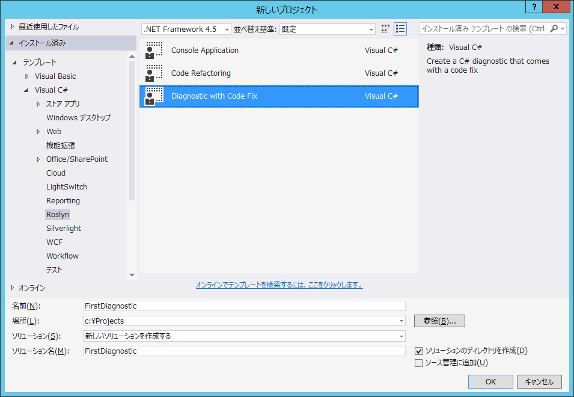
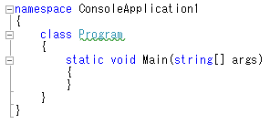
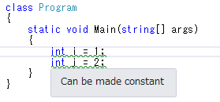
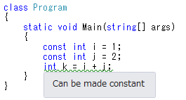
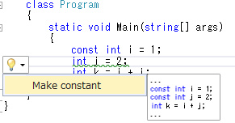
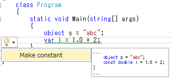

# How To: C#による診断機能およびコード修正機能を実装する方法

原文：[How To: Write a C# Diagnostic and Code Fix](http://www.codeplex.com/Download?ProjectName=roslyn&DownloadId=822458)

2014年4月

## はじめに

これまでにリリースされているVisual Studioでは C# や Visual Basic を
対象とする警告機能を独自に実装することは簡単ではありません。
しかし .NET Compiler Platform ("Roslyn") の診断用APIを使用すれば
この難しい機能が簡単に実現できます！
必要になるのは問題を特定するための分析処理を行うことだけです。
また、場合によってはツリーの変形を行うことでコードを修正することも可能です。
バックグラウンドスレッドで分析処理を実行開始したり、
エディタ上で波状の下線を表示したり、
Visual Studioのエラーリストに項目を追加したり、
修正案の通知のために「電球マーク」を用意したり、
リッチなプレビューを表示したりといった複雑な処理はいずれも自動的に行われます。

このウォークスルーではRoslynのAPIを使用して診断機能(Diagnostic)を作成し、
さらにコード修正機能(Code Fix)も追加します。
診断機能とはソースコードの分析を行い、問題をユーザーに通知する機能のことです。
また診断機能のオプションとして、ユーザーの作成したソースコードに対する
変更を提案するコード修正機能を実装することもできます。
たとえば大文字で始まるローカル変数名をすべて検出するような診断機能を作成し、
さらにそれらの変数名を小文字始まりに修正するような
コード修正機能を実装したりできます。

## 診断機能を実装する

たとえば任意のローカル変数宣言に対して、
それがローカル定数に変換出来る場合には警告表示するような機能を実装したいとします。
つまり以下のようなコードがあるとします：

```csharp
int x = 0;
Console.WriteLine(x);
```

このコードにある `x` には定数値が割り当てられ、変更されていません。
したがってこの宣言には `const` 修飾子を追加できます：

```csharp
const int x = 0;
Console.WriteLine(x);
```

変数が定数に変換可能かどうかを検出する機能は実際にはやや複雑で、
文法的な解析を行い、初期化子の式が定数かどうかを解析し、
変数が決して変更されていないことを確認する必要があります。
しかし .NET Compiler Platform を使用すれば非常に簡単に
この解析機能を実装し、診断機能として公開することができます。

1. まず C# Diagnostic プロジェクトを新規作成します。
  * Visual Studioで[ファイル]-[新規作成]-[プロジェクト]を選択して
    [新しいプロジェクト]ダイアログを表示します。
  * [Visual C#]-[Roslyn] 以下から [Diagnostic with Code Fix] を選択します。
  * プロジェクトの名前を **`FirstDiagnostic`** として[OK]をクリックします。
    
    
2. `Ctrl+F5` キーを押して、Roslyn Previewの拡張機能が読み込まれた
   2つめのVisual Studio上でこの新規作成した診断機能プロジェクトを実行します。
  * 起動した2つめのVisual Studioインスタンス上でC# コンソールアプリケーション
    プロジェクトを新規作成します。
    すると波状の下線がトークンにホバー表示され、診断機能で指定された
    警告文が表示されます。
    
    波状の下線が表示されない場合には[ツール]-[拡張機能と更新プログラム]を開いて
    Roslyn Previewが有効になっていることを確認してください。
    Roslyn Previewがリストに表示されていない場合にはSDK Previewの
    .zipファイル内にある `Install Roslyn Preview into Roslyn Experimental Hive.exe`
    を実行する必要があるでしょう。
    
    この診断機能はデバッガープロジェクトの `AnalyzeSymbol` メソッドで
    実装されています。
    したがってC#ファイル内にあって小文字を識別子名に含むような、
    すべての型宣言を検出するコードが初期状態でデバッガープロジェクトには
    用意されているというわけです。
    
    
  * 初期状態の診断機能が確認出来たので、2つめのVisual Studioインスタンスを終了して
    診断機能プロジェクトに戻ります。
3. 診断分析機能を実装している、プロジェクト内のDiagnosticAnalyzer.csファイルを
   少し確認してみましょう。
   注意すべき点は以下の2点です：
  * 診断分析機能にはいずれも `[ExportDiagnosticAnalyzer]` 属性を
    指定する必要があります。
    この属性には診断機能IDや対象とする言語など、重要な項目を設定します。
    なお現時点ではさらに `[DiagnosticAnalyzer]` 属性も指定する必要があります。
    これは既知の不具合です。
  * 診断分析機能では `IDiagnosticAnalyzer` 派生のインターフェイスを
    1つ以上実装する必要があります。
    今回の場合、テンプレートではデフォルトで `ISymbolAnalyzer` インターフェイスが
    実装されています。
    このインターフェイスでは `AnalyzeSymbol` と呼ばれるメソッドを
    実装する必要があります。
    このメソッドは対象のコードにおいてシンボルの宣言が変更されたり、
    シンボルが追加されたりした場合に毎回呼ばれます。
4. 今回実装する、ローカル変数を定数に変換可能かどうか解析する機能に対しては、
   いくつかの実装方法が考えられます。
   直感的な方法としては `ISyntaxNodeAnalyzer<TSyntaxKind>` インターフェイスを
   実装して、ローカル宣言に対するシンタックスノードを一度に1つずつ
   チェックしていき、初期化子が定数であることを確認することになります。
   そのため、まずは以下の操作を行います：
  * `DiagnosticAnalyzer` 型に実装されている `ISymbolAnalyzer` インターフェイスを
    `ISyntaxNodeAnalyzer<SyntaxKind>` に変更します。
    波線が表示されている `SyntaxKind` 型の位置で `Ctrl+.` キーを押して
    `Microsoft.CodeAnalysis.CSharp` 名前空間のusingを追加します。
    型宣言の上にあるTODOのコメントを削除します。
  * 既に実装されているメンバー `SymbolKindsOfInterest` および `AnalyzeSymbol` を
    削除します。
    これらは使用されません。
  * `ISyntaxNodeAnalyzer<SyntaxKind>` が実装されていないことを示す
    赤い波線が表示されるので、 `DiagnosticAnalyzer` をクリックします。
    `Ctrl+.` を押して Implement interface を選択し、
    `SyntaxKindsOfInterest` と `AnalyzeNode` のひな形を追加します。
  * `LocaldeclarationStatement` が対象とする `SyntaxKind` であることを示すように
    `SyntaxKindsOfInterest` プロパティを実装します。
    
    ```csharp
    return ImmutableArray.Create(SyntaxKind.LocalDeclarationStatement);
    ```
  * 定数化のルールに一致するよう、型定義の先頭にある `internal const string` で
    定義された診断機能のメタデータを更新します。
    
    ```csharp
    internal const string DiagnosticId = "MakeConst";
    internal const string Description = "Make Constant";
    internal const string MessageFormat = "Can be made constant";
    internal const string Category = "Usage";
    ```
  * 以上の手順を行った後、`DiagnosticAnalyzer.cs` のコードは
    以下のようになっているはずです：
    
    ```csharp
    using System;
    using System.Collections.Generic;
    using System.Collections.Immutable;
    using System.Linq;
    using System.Threading;
    using Microsoft.CodeAnalysis;
    using Microsoft.CodeAnalysis.CSharp;
    using Microsoft.CodeAnalysis.Diagnostics;

    namespace FirstDiagnostic
    {
        [DiagnosticAnalyzer]
        [ExportDiagnosticAnalyzer(DiagnosticId, LanguageNames.CSharp)]
        public class DiagnosticAnalyzer : ISyntaxNodeAnalyzer<SyntaxKind>
        {
            internal const string DiagnosticId = "MakeConst";
            internal const string Description = "Make Constant";
            internal const string MessageFormat = "Can be made constant";
            internal const string Category = "Usage";

            internal static DiagnosticDescriptor Rule = new DiagnosticDescriptor(DiagnosticId, Description, MessageFormat, Category, DiagnosticSeverity.Warning);

            public ImmutableArray<DiagnosticDescriptor> SupportedDiagnostics { get { return ImmutableArray.Create(Rule); } }

            public ImmutableArray<SyntaxKind> SyntaxKindsOfInterest
            {
                get
                {
                    return ImmutableArray.Create(SyntaxKind.LocalDeclarationStatement);
                }
            }

            public void AnalyzeNode(SyntaxNode node, SemanticModel semanticModel, Action<Diagnostic> addDiagnostic, CancellationToken cancellationToken)
            {
                throw new NotImplementedException();
            }
        }
    }
    ```
  * これでローカル変数が定数化できるかどうか判断するロジックを
    `AnalyzeNode` メソッドに作成する準備が整いました。
5. まず文法的な解析を行う必要があります。
  * `AnalyzeNode` メソッドで引数 `node` を `LocalDeclaratoinStatementSyntax` 型に
    キャストします。
    `SyntaxKindsOfInterest` プロパティの実装により、この型のシンタックスノードだけが
    対象となるように診断用アナライザーが動作するため、直接キャストしても
    エラーにならないとみなすことができます。
    `Ctrl+.` キーを押して、ここで必要となる`Microsoft.CodeAnalysis.CSharp.Syntax`
    名前空間に対するusingステートメントを追加します。
    
    ```csharp
    var localDeclaration = (LocalDeclarationStatementSyntax)node;
    ```
  * ローカル変数に `const` 修飾子が既に付けられていないことを確認します。
    変数が既にconstとして宣言されている場合にはこれ以上の診断を行わず、
    早い段階で処理を終了させます。
    
    ```csharp
    // constとして宣言されていないローカル変数だけを対象とします。
    if (localDeclaration.Modifiers.Any(SyntaxKind.ConstKeyword))
    {
        return;
    }
    ```
6. 次に `SemanticModel` 型の引数を使用して、ローカル変数が定数化できるかどうか、
   文法的な解析処理をいくつか行います。
   `SemanticModel` は1つのソースファイル中にあるすべての文法情報を表すものです。
   セマンティックモデルの詳細については
   [.NET Compiler Platform プロジェクト概要](../overview.md)
   を参照してください。
  * 宣言されている変数が初期化子を持つことを確認します。
    C#の仕様として、すべての定数は必ず初期化されなければならないため、
    必ずこれを確認しておきます。
    たとえば `int x = 0, y = 1;` は定数化できますが、 `int x, y = 1` は出来ません。
    また、`SemanticModel` を使用して変数の初期化子がコンパイル時定数であることを
    確認します。
    これは変数の初期化子それぞれに対して `SemanticModel.GetConstantValue()`
    を呼び出し、返り値 `Otional<object>` が値を持つかどうかチェックすることで
    確認できます。
    
    ```csharp
    // ローカルで宣言されたすべての変数に対して
    // 定数値が割り当てられているかどうかを確認します。
    foreach (var variable in localDeclaration.Declaration.Variables)
    {
        var initializer = variable.Initializer;
        if (initializer == null)
        {
            return;
        }

        var constantValue = semanticModel.GetConstantValue(initializer.Value);
        if (!constantValue.HasValue)
        {
            return;
        }
    }
    ```
  * `SemanticModel` を使用して、ローカルで宣言されたステートメントに対する
    データフローを解析します。
    そしてデータフロー解析の結果を使用して、ローカル変数が別の場所で
    書き換えられていないことを確認します。
    これは各変数に対して `SemanticModel.GetDeclaredSymbol` メソッドを呼び、
    返された `ILocalSymbol` がデータフロー解析の `WrittenOutside` コレクションに
    含まれていないことをチェックすることで確認できます。
    
    ```csharp
    // ローカル宣言に対してデータフロー解析を行います。
    var dataFlowAnalysis = semanticModel.AnalyzeDataFlow(localDeclaration);

    // ローカルに宣言された各変数に対するローカルシンボルを取得し、
    // データフロー解析の領域外で書き換えられていないことを確認します。
    foreach (var variable in localDeclaration.Declaration.Variables)
    {
        var variableSymbol = semanticModel.GetDeclaredSymbol(variable);
        if (dataFlowAnalysis.WrittenOutside.Contains(variableSymbol))
        {
            return;
        }
    }
    ```
7. 必要なすべての解析を行った後は、非定数の変数宣言に対する警告を表す
   `Diagnostic` オブジェクトを新規作成します。
   この `Diagnostic` オブジェクトにはコードの上方で定義されている
   `Rule` テンプレートをメタデータとして設定します。
   そして `addDiagnostic` デリゲートの引数として渡すことによって警告を通知できます。
   
   ```csharp
   addDiagnostic(Diagnostic.Create(Rule, node.GetLocation()));
   ```
   
   この時点で `AnalyzeNode` メソッドは以下のようになっているはずです：
   
   ```csharp
   public void AnalyzeNode(SyntaxNode node, SemanticModel semanticModel, Action<Diagnostic> addDiagnostic, CancellationToken cancellationToken)
   {
       var localDeclaration = (LocalDeclarationStatementSyntax)node;
   
       // constとして宣言されていないローカル変数だけを対象とします。
       if (localDeclaration.Modifiers.Any(SyntaxKind.ConstKeyword))
       {
           return;
       }
   
       // ローカルで宣言されたすべての変数に対して
       // 定数値が割り当てられているかどうかを確認します。
       foreach (var variable in localDeclaration.Declaration.Variables)
       {
           var initializer = variable.Initializer;
           if (initializer == null)
           {
               return;
           }
   
           var constantValue = semanticModel.GetConstantValue(initializer.Value);
           if (!constantValue.HasValue)
           {
               return;
           }
       }
   
       // ローカル宣言に対してデータフロー解析を行います。
       var dataFlowAnalysis = semanticModel.AnalyzeDataFlow(localDeclaration);
   
       // ローカルに宣言された各変数に対するローカルシンボルを取得し、
       // データフロー解析の領域外で書き換えられていないことを確認します。
       foreach (var variable in localDeclaration.Declaration.Variables)
       {
           var variableSymbol = semanticModel.GetDeclaredSymbol(variable);
           if (dataFlowAnalysis.WrittenOutside.Contains(variableSymbol))
           {
               return;
           }
       }
   
       addDiagnostic(Diagnostic.Create(Rule, node.GetLocation()));
   }
   ```
8. `Ctrl+F5` を押して、Roslyn Preview拡張機能がロードされた2つめのVisual Studio
   インスタンス上で診断機能プロジェクトを実行します。
  * 2つめのVisual Studioインスタンス上でC# コンソール アプリケーションプロジェクトを
    作成して、`Main` メソッドの中で定数値で初期化されたローカル変数宣言を
    いくつか追加します。
    
    ```csharp
    ```
  * 以下のような警告が表示されます。
    
    
  * また、それぞれの変数の前に `const` を追加すると警告が自動的に消えます。
    さらに、定数化された変数は他の変数にも影響することが確認できます。
    
    
9. おめでとうございます！
   これで.NET Compiler Platform APIを使用して、
   やや複雑な文法的ならびに意味的解析を行い、
   初めての診断機能を実装することができました。

## コード修正機能を実装する

診断機能には、報告された問題に対するソースコードを編集するコード修正機能を
1つ以上実装できます。
先ほど作成した診断機能の場合、ユーザーがエディタ上で電球UIをクリックすれば
constキーワードを挿入するようなコード修正機能が実装できます。
具体的には以下の手順で行います。

1. まず Diagnostic with Code Fix のテンプレートにより既に追加されている
   `CodeFixProvider.cs` ファイルを開きます。
   このコード修正機能には診断アナライザーと同じ診断機能IDが関連づけられていますが、
   コード変換機能はまだ実装されていません。
2. `MakeUppercaseAsync` メソッドを削除します。
   このメソッドは使用されません。
3. `GetFixesAsync` メソッドにて、検索対象が診断機能と一致するように
   `LocalDeclarationStatementSyntax` に変更します。
    
    ```csharp
    // 診断機能によって識別されたローカル宣言を検索します。
    var declaration = root.FindToken(diagnosticSpan.Start).Parent.AncestorsAndSelf().OfType<LocalDeclarationStatementSyntax>().First();
    ```
4. `CodeAction` オブジェクトを生成している最終行を変更して、
   これから定義することになる `MakeConstAsync` メソッドを呼び出すようにします。
   またTODOコメントも削除します。
   各 `CodeAction` はユーザーがVisual Studio上で選択できる項目をそれぞれ表します。
    
    ```csharp
    return new[] { CodeAction.Create("Make constant", c => MakeConstAsync(document, declaration, c)) };
    ```
5. この時点でコードは以下のようになっているはずです：
    
    ```csharp
    using System.Collections.Generic;
    using System.Linq;
    using System.Threading;
    using System.Threading.Tasks;
    using Microsoft.CodeAnalysis;
    using Microsoft.CodeAnalysis.CodeFixes;
    using Microsoft.CodeAnalysis.CodeActions;
    using Microsoft.CodeAnalysis.CSharp;
    using Microsoft.CodeAnalysis.CSharp.Syntax;
    using Microsoft.CodeAnalysis.Rename;
    using Microsoft.CodeAnalysis.Text;
    
    namespace FirstDiagnostic
    {
        [ExportCodeFixProvider(DiagnosticAnalyzer.DiagnosticId, LanguageNames.CSharp)]
        internal class CodeFixProvider : ICodeFixProvider
        {
            public IEnumerable<string> GetFixableDiagnosticIds()
            {
                return new[] { DiagnosticAnalyzer.DiagnosticId };
            }
    
            public async Task<IEnumerable<CodeAction>> GetFixesAsync(Document document, TextSpan span, IEnumerable<Diagnostic> diagnostics, CancellationToken cancellationToken)
            {
                var root = await document.GetSyntaxRootAsync(cancellationToken).ConfigureAwait(false);
    
                var diagnosticSpan = diagnostics.First().Location.SourceSpan;
    
                // 診断機能によって識別されたローカル宣言を検索します。
                var declaration = root.FindToken(diagnosticSpan.Start).Parent.AncestorsAndSelf().OfType<LocalDeclarationStatementSyntax>().First();
    
                // Return a code action that will invoke the fix.
                return new[] { CodeAction.Create("Make constant", c => MakeConstAsync(document, declaration, c)) };
            }
        }
    }
    ```
6. そして `MakeConstAsync` を実装します。
   このメソッドは元の `Document` を修正後の `Document` に変換します。
  * まず以下のシグネチャで `MakeConstAsync` を宣言します。
    このメソッドはユーザーのソースコードを表す `Document` を変換して、
    `const` 宣言を含んだ `Document` へと修正します。
    
    ```csharp
    private async Task<Document> MakeConstAsync(Document document, LocalDeclarationStatementSyntax localDeclaration, CancellationToken cancelationToken)
    ```
  * 次に宣言ステートメントの前に挿入されることになる
    `const` キーワードトークンを新規作成します。
    まず、宣言ステートメントの最初のトークンから前方トリヴィアを削除して、
    それを `const` トークンにアタッチしていることに注意してください。
    
    ```csharp
    // ローカル宣言から前方トリヴィアを削除します。
    var firstToken = localDeclaration.GetFirstToken();
    var leadingTrivia = firstToken.LeadingTrivia;
    var trimmedLocal = localDeclaration.ReplaceToken(firstToken, firstToken.WithLeadingTrivia(SyntaxTriviaList.Empty));
    
    // 前方トリヴィアを持ったconstトークンを作成します。
    var constToken = SyntaxFactory.Token(leadingTrivia, SyntaxKind.ConstKeyword, SyntaxFactory.TriviaList(SyntaxFactory.ElasticMarker));
    ```
  * 次に `const` トークンおよび既存の宣言ステートメントの修飾子を含んだ
    `SyntaxTokenList` を作成します。
    
    ```csharp
    // 修飾子リストにconstトークンを挿入して、新しい修飾子リストを作成します。
    var newModifiers = trimmedLocal.Modifiers.Insert(0, constToken);
    ```
  * 新しい修飾子リストを持った宣言ステートメントを新規作成します。
    
    ```csharp
    // 新しいローカル宣言を作成します。
    var newLocal = trimmedLocal.WithModifiers(newModifiers);
    ```
  * 新しい宣言ステートメントに `Formatter` シンタックスアノテーションを追加します。
    これはC#のフォーマット規則に従って空白文字が整形されるよう
    コード修正エンジンに指示するために必要です。
    なおFormatter型の上で `Ctrl+.` を押して、
    `Microsoft.CodeAnalysis.Formatting` 名前空間のusingステートメントを挿入する必要があります。
    
    ```csharp
    // 新しいローカル宣言を整形するためにアノテーションを追加します。
    var formattedLocal = newLocal.WithAdditionalAnnotations(Formatter.Annotation);
    ```
  * `Document` からルートの `SyntaxNode` を取得して、
    古い宣言ステートメントを新しいものに置き換えます。
    
    ```csharp
    // 古いローカル宣言を新しいローカル宣言に置き換えます。
    var oldRoot = await document.GetSyntaxRootAsync(cancellationToken);
    var newRoot = oldRoot.ReplaceNode(localDeclaration, formattedLocal);
    ```
  * 最後に、更新されたシンタックスルートを含む新しい `Document` を返します。
    この `Document` にはこれまで行ってきたツリー変換の結果が反映されています。
    
    ```csharp
    // 変換後のツリーを含むドキュメントを返します。
    return document.WithSyntaxRoot(newRoot);
    ```
  * この時点で `MakeConstAsync` メソッドは以下のようになっているはずです：
    
    ```csharp
    private async Task<Document> MakeConstAsync(Document document, LocalDeclarationStatementSyntax localDeclaration, CancellationToken cancellationToken)
    {
        // ローカル宣言から前方トリヴィアを削除します。
        var firstToken = localDeclaration.GetFirstToken();
        var leadingTrivia = firstToken.LeadingTrivia;
        var trimmedLocal = localDeclaration.ReplaceToken(firstToken, firstToken.WithLeadingTrivia(SyntaxTriviaList.Empty));

        // 前方トリヴィアを持ったconstトークンを作成します。
        var constToken = SyntaxFactory.Token(leadingTrivia, SyntaxKind.ConstKeyword, SyntaxFactory.TriviaList(SyntaxFactory.ElasticMarker));

        // 修飾子リストにconstトークンを挿入して、新しい修飾子リストを作成します。
        var newModifiers = trimmedLocal.Modifiers.Insert(0, constToken);

        // 新しいローカル宣言を作成します。
        var newLocal = trimmedLocal.WithModifiers(newModifiers);

        // 新しいローカル宣言を整形するためにアノテーションを追加します。
        var formattedLocal = newLocal.WithAdditionalAnnotations(Formatter.Annotation);

        // 古いローカル宣言を新しいローカル宣言に置き換えます。
        var oldRoot = await document.GetSyntaxRootAsync(cancellationToken);
        var newRoot = oldRoot.ReplaceNode(localDeclaration, formattedLocal);

        // 変換後のツリーを含むドキュメントを返します。
        return document.WithSyntaxRoot(newRoot);
    }
    ```
7. `Ctrl+F5` キーを押して、Roslyn Preview拡張機能がロードされた
   2つめのVisual Studioインスタンス上で診断機能プロジェクトを実行します。
  * 2つめのVisual Studioインスタンス上でC# コンソール アプリケーションプロジェクトを
    新規作成して、先と同じく `Main` メソッド内に定数で初期化されたローカル変数宣言を
    いくつか追加します。
    
    ```csharp
    static void Main(string[] args)
    {
        int i = 1;
        int j = 2;
        int k = i + j;
    }
    ```
  * 警告が表示されること、ならびにカーソルを警告行に移動させると「電球」アイコンが
    表示されることを確認してください。
  * 波線の表示されているいずれかの行にカーソルを移動させて `Ctrl+.` を押し、
    候補リストを表示させます。
    なお候補リストの隣にはプレビューウィンドウが表示されて、
    コード修正機能によって修正後のコードがどのようになるのか確認することができます。
    
    

## バグ修正

残念なことに、現在の実装にはバグがあります。

1. 診断アナライザーの `AnalyzeNode` メソッドは定数値が実際に値型と互換性があるかどうかを
   チェックしていません。
   そのため、現在の実装では `int i = "abc"` というような間違った宣言であっても
   変換してしまいます。
2. 参照型が正しく処理されません。
   `System.String` 型を除けば、参照型に対する定数として正しいものは `null` だけです。
   `System.String` には文字列リテラルを指定できます。
   つまり `const string s = "abc"` は正しいですが、
   `const object s = "abc"` は正しくありません。
3. 変数が `var` キーワードで定義されていた場合、コード修正機能は `const var` という、
   C#言語ではサポートされていない間違った宣言を生成してしまいます。
   このバグを修正するためには `var` キーワードを推測後の型に置き換える必要があります。

幸いにもこれらのバグはいずれもこれまでに習得したテクニックを組み合わせることで解決できます。

1. 1番目のバグを修正するためにまずは `DiagnosticAnalyzer.cs` を開いて、
   各ローカル宣言の初期化子が定数値を割り当てているかどうか確認している
   `foreach` ループに移動します。
  * `foreach` ループの **直前** で `SemanticModel.GetTypeInfo()` を呼んで
    ローカル宣言の詳細な型情報を取得します：
    
    ```csharp
    var variableTypeName = localDeclaration.Declaration.Type;
    var variableType = semanticModel.GetTypeInfo(variableTypeName).ConvertedType;
    ```
  * 次に、`SemanticModel.ClassifyConversion()` を呼んで、
    初期化子の型がローカル宣言の型と互換性があるかどうかをチェックする
    以下のコードを `foreach` ループの閉じ括弧の直前に追加します。
    変換できない、あるいはユーザー定義の変換になっている場合には
    ローカル変数を定数化できないものとします。
    
    ```csharp
    // 初期化子の値がユーザー定義の変換を行わずとも
    // ローカル宣言の型と互換性があることを確認します。
    var conversion = semanticModel.ClassifyConversion(initializer.Value, variableType);
    if (!conversion.Exists || conversion.IsUserDefined)
    {
        return;
    }
    ```
2. 2番目のバグは1番目の修正を元に修正します。
  * 先と同じ `foreach` ループの閉じ括弧の直前に以下のコードを追加して、
    定数が文字かnullの場合にはローカル宣言の型をチェックするようにします。
    
    ```csharp

    // 特殊ケース：
    //  * 定数値が文字列の場合、ローカル宣言の型は System.String でなければいけない。
    //  * 定数値が nullの場合、ローカル宣言の型は参照型でなければいけない。
    if (constantValue.Value is string)
    {
        if (variableType.SpecialType != SpecialType.System_String)
        {
            return;
        }
    }
    else if (variableType.IsReferenceType && constantValue.Value != null)
    {
        return;
    }
    ```
  * これらのコードを追加した後の `AnalyzeNode` メソッドは以下のようになるはずです：
    
    ```csharp
    public void AnalyzeNode(SyntaxNode node, SemanticModel semanticModel, Action<Diagnostic> addDiagnostic, CancellationToken cancellationToken)
    {
        var localDeclaration = (LocalDeclarationStatementSyntax)node;

        // constとして宣言されていないローカル変数だけを対象とします。
        if (localDeclaration.Modifiers.Any(SyntaxKind.ConstKeyword))
        {
            return;
        }

        var variableTypeName = localDeclaration.Declaration.Type;
        var variableType = semanticModel.GetTypeInfo(variableTypeName).ConvertedType;

        // ローカルで宣言されたすべての変数に対して
        // 定数値が割り当てられているかどうかを確認します。
        foreach (var variable in localDeclaration.Declaration.Variables)
        {
            var initializer = variable.Initializer;
            if (initializer == null)
            {
                return;
            }

            var constantValue = semanticModel.GetConstantValue(initializer.Value);
            if (!constantValue.HasValue)
            {
                return;
            }

            // 初期化子の値がユーザー定義の変換を行わずとも
            // ローカル宣言の型と互換性があることを確認します。
            var conversion = semanticModel.ClassifyConversion(initializer.Value, variableType);
            if (!conversion.Exists || conversion.IsUserDefined)
            {
                return;
            }

            // 特殊ケース：
            //  * 定数値が文字列の場合、ローカル宣言の型は System.String でなければいけない。
            //  * 定数値が nullの場合、ローカル宣言の型は参照型でなければいけない。
            if (constantValue.Value is string)
            {
                if (variableType.SpecialType != SpecialType.System_String)
                {
                    return;
                }
            }
            else if (variableType.IsReferenceType && constantValue.Value != null)
            {
                return;
            }
        }

        // ローカル宣言に対してデータフロー解析を行います。
        var dataFlowAnalysis = semanticModel.AnalyzeDataFlow(localDeclaration);

        // ローカルに宣言された各変数に対するローカルシンボルを取得し、
        // データフロー解析の領域外で書き換えられていないことを確認します。
        foreach (var variable in localDeclaration.Declaration.Variables)
        {
            var variableSymbol = semanticModel.GetDeclaredSymbol(variable);
            if (dataFlowAnalysis.WrittenOutside.Contains(variableSymbol))
            {
                return;
            }
        }

        addDiagnostic(Diagnostic.Create(Rule, node.GetLocation()));
    }
    ```
3. 3番目の問題を修正するためには、 `var` キーワードを正しい型名に置き換えるコードを
   もう少し追加する必要があります。
  * `CodeFixProvider.cs` ファイルに戻って「新しいローカル宣言を作成します」という
    コメントが付けられたコードのあたりを以下のコードに置き換えます：
    
    ```csharp
    // 宣言の型が'var' の場合、推測された型に対する新しい型名を作成します。
    var variableDeclaration = localDeclaration.Declaration;
    var variableTypeName = variableDeclaration.Type;
    if (variableTypeName.IsVar)
    {

    }

    // 新しいローカル宣言を作成します。
    var newLocal = trimmedLocal.WithModifiers(newModifiers)
                                .WithDeclaration(variableDeclaration);
    ```
  * 次にこのifブロック内で、宣言された変数の型がエイリアスではないことをチェックします。
    もしも別の型に対するエイリアスになっている
    (つまり `using var = System.String;` とされている)場合には
    ローカル変数を `const var` と宣言できます。
    
    ```csharp
    var semanticModel = await document.GetSemanticModelAsync(cancellationToken);

    // 特殊ケース：'var'が別の型のエイリアスではない
    // (たとえば using var = System.String とされていない)ことを確認します。
    var aliasInfo = semanticModel.GetAliasInfo(variableTypeName);
    if (aliasInfo == null)
    {

    }
    ```
  * このコードの波括弧内に以下のコードを追加して、
    `var` に対応する型情報を取得します。
    
    ```csharp
    // varに対応する型を取得します。
    var type = semanticModel.GetTypeInfo(variableTypeName).ConvertedType;

    // 特殊ケース：'var' が実際に 'var' という名前の型ではないことを確認します。
    if (type.Name != "var")
    {

    }
    ```
  * そしてこのifブロックの内側に以下のコードを追加して、
    推測された型に対する新しい `TypeSyntax` を作成します。
    
    ```csharp
    // 推測された型に対するTypeSyntaxを新規作成します。
    // なおvarキーワードの前後にあるトリヴィアが保持されるよう注意してください。
    var typeName = SyntaxFactory.ParseTypeName(type.ToDisplayString())
        .WithLeadingTrivia(variableTypeName.GetLeadingTrivia())
        .WithTrailingTrivia(variableTypeName.GetTrailingTrivia());
    ```
  * 型名に`Simplifier`シンタックスアノテーションを追加して、
    コード修正エンジンが最小限に修飾された型名を出力するようにします。
    `Simplifier` 上で `Ctrl+.` を押して `Microsoft.CodeAnalysis.Simplification`
    名前空間のusingステートメントを追加します。
    
    ```csharp
    // 型名を単純化するためのアノテーションを追加します。
    var simplifiedTypeName = typeName.WithAdditionalAnnotations(Simplifier.Annotation);
    ```
  * 最後に変数宣言の型をこの新しい型で置き換えます。
    
    ```csharp
    // 変数宣言の型を置き換えます。
    variableDeclaration = variableDeclaration.WithType(simplifiedTypeName);
    ```
  * バグ修正後の `MakeConstAsync` メソッドは以下のようになっているはずです：
    
    ```csharp
    private async Task<Document> MakeConstAsync(Document document, LocalDeclarationStatementSyntax localDeclaration, CancellationToken cancellationToken)
    {
        // ローカル宣言から前方トリヴィアを削除します。
        var firstToken = localDeclaration.GetFirstToken();
        var leadingTrivia = firstToken.LeadingTrivia;
        var trimmedLocal = localDeclaration.ReplaceToken(firstToken, firstToken.WithLeadingTrivia(SyntaxTriviaList.Empty));

        // 前方トリヴィアを持ったconstトークンを作成します。
        var constToken = SyntaxFactory.Token(leadingTrivia, SyntaxKind.ConstKeyword, SyntaxFactory.TriviaList(SyntaxFactory.ElasticMarker));

        // 修飾子リストにconstトークンを挿入して、新しい修飾子リストを作成します。
        var newModifiers = trimmedLocal.Modifiers.Insert(0, constToken);

        // 宣言の型が'var' の場合、推測された型に対する新しい型名を作成します。
        var variableDeclaration = localDeclaration.Declaration;
        var variableTypeName = variableDeclaration.Type;
        if (variableTypeName.IsVar)
        {
            var semanticModel = await document.GetSemanticModelAsync(cancellationToken);

            // 特殊ケース：'var'が別の型のエイリアスではない
            // (たとえば using var = System.String とされていない)ことを確認します。
            var aliasInfo = semanticModel.GetAliasInfo(variableTypeName);
            if (aliasInfo == null)
            {
                // varに対応する型を取得します。
                var type = semanticModel.GetTypeInfo(variableTypeName).ConvertedType;

                // 特殊ケース：'var' が実際に 'var' という名前の型ではないことを確認します。
                if (type.Name != "var")
                {
                    // 推測された型に対するTypeSyntaxを新規作成します。
                    // なおvarキーワードの前後にあるトリヴィアが保持されるよう注意してください。
                    var typeName = SyntaxFactory.ParseTypeName(type.ToDisplayString())
                        .WithLeadingTrivia(variableTypeName.GetLeadingTrivia())
                        .WithTrailingTrivia(variableTypeName.GetTrailingTrivia());

                    // 型名を単純化するためのアノテーションを追加します。
                    var simplifiedTypeName = typeName.WithAdditionalAnnotations(Simplifier.Annotation);

                    // 変数宣言の型を置き換えます。
                    variableDeclaration = variableDeclaration.WithType(simplifiedTypeName);
                }
            }
        }

        // 新しいローカル宣言を作成します。
        var newLocal = trimmedLocal.WithModifiers(newModifiers)
                                    .WithDeclaration(variableDeclaration);

        // 新しいローカル宣言を整形するためにアノテーションを追加します。
        var formattedLocal = newLocal.WithAdditionalAnnotations(Formatter.Annotation);

        // 古いローカル宣言を新しいローカル宣言に置き換えます。
        var oldRoot = await document.GetSyntaxRootAsync(cancellationToken);
        var newRoot = oldRoot.ReplaceNode(localDeclaration, formattedLocal);

        // 変換後のツリーを含むドキュメントを返します。
        return document.WithSyntaxRoot(newRoot);
    }
    ```
4. もう一度 `Ctrl+F5` を押して、Roslyn Preview拡張機能がロードされた
   2つめのVisual Studioインスタンス上で診断機能プロジェクトを実行します。
  * 2つめのVisual Studioインスタンス上でC# コンソール アプリケーションプロジェクトを
    新規作成して、 `Main` メソッド内に `int x = "abc";` と追加します。
    1番目のバグを修正したので、このローカル変数宣言に対する警告は表示されなくなります
    (ただし意図通り、このコードではコンパイルエラーになります)。
  * 次に `Main` メソッドに `object s = "abc";` と追加します。
    2番目のバグを修正したので、警告は表示されなくなります。
  * 最後に `var` キーワードを使用したローカル変数宣言を追加します。
    すると警告とともに、左側に候補アイコンが表示されます。
  * エディタ上で波線表示された行にカーソルを移動して `Ctrl+.` を押し、
    修正候補となるコードを表示します。
    コード修正機能を選択すると `var` キーワードが適切に処理されていることが確認できます。
    
    
5．おめでとうございます！
   以上でコードを即座に分析して問題を検出し、その問題を簡単に修正するような
   .NET Compiler Platformの拡張機能を初めて作成することができました。
